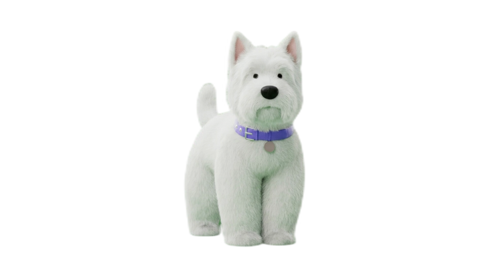
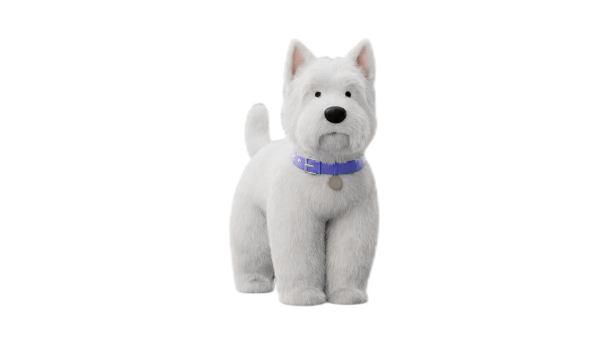
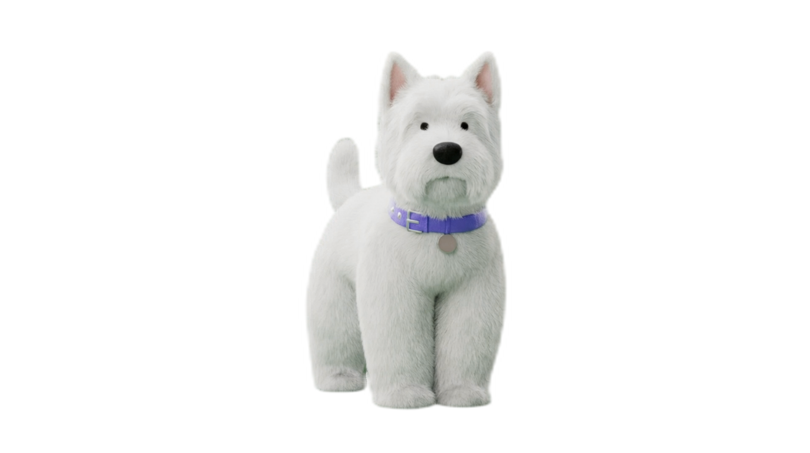
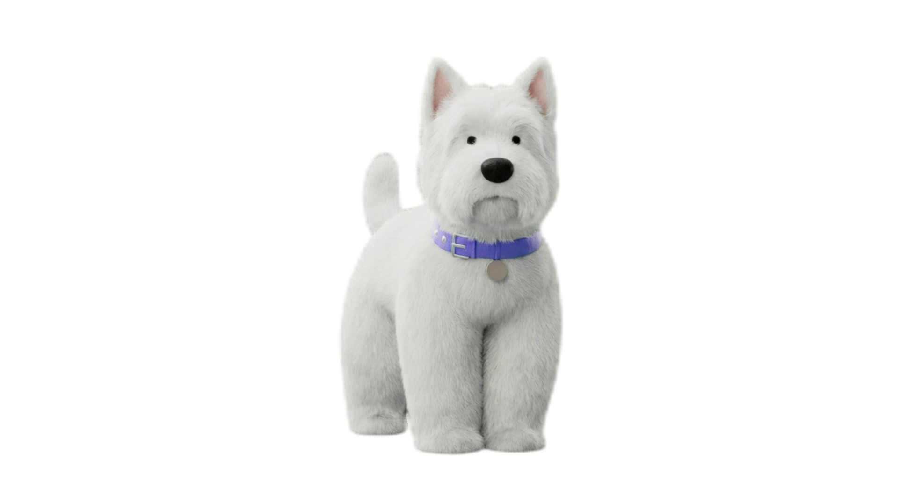

# 绿幕去溢色（Green Spill Removal）技术文档

## 问题描述

在绿幕拍摄中，绿色背景的光线会反射到拍摄主体上，导致：
- 皮肤呈现不自然的绿色调
- 衣服边缘带有绿色光晕
- 头发丝有绿色反光

这种现象称为"绿幕溢色"（Green Spill），即使完美抠图后仍会残留在主体上。

## 算法原理

### 核心思想

绿色溢出的本质是：**像素的绿色通道值异常偏高**。

正常情况下，自然物体的 RGB 三通道相对平衡。当绿幕光线反射到物体上时，绿色通道会被异常增强。

### 方法 1：Average（红蓝平均值法）

```
溢出量 = G - (R + B) / 2
G_new = G - 溢出量 × 强度
```

**原理：** 将绿色通道限制为不超过红蓝通道的平均值。

**特点：**
- 温和，保留更多原始色彩
- 适合轻度溢色
- 处理后色调偏暖

### 方法 2：Max（红蓝最大值法）

```
溢出量 = G - max(R, B)
G_new = G - 溢出量 × 强度
```

**原理：** 将绿色通道限制为不超过红蓝通道的最大值。

**特点：**
- 激进，去溢色更彻底
- 适合重度溢色
- 可能导致部分绿色物体失真

## 参数说明

| 参数 | 说明 | 默认值 | 范围 |
|------|------|--------|------|
| `--despill` | 启用去溢色 | 关闭 | - |
| `--spill-strength` | 去溢色强度 | 1.0 | 0.0-1.0 |
| `--spill-method` | 去溢色方法 | average | average/max |

### 强度参数效果

- `0.0`: 不处理
- `0.5`: 去除 50% 的绿色溢出
- `1.0`: 完全去除绿色溢出

## 效果对比

### 测试素材
- 视频：扣色测试.mp4
- 分辨率：1924×1076
- 绿幕拍摄素材


### 视觉对比

#### 1. 仅边缘清理（对照组）


*主体仍有明显的绿色反光，皮肤偏绿*

#### 2. Average 方法 + 强度 1.0（推荐）


*绿色溢出明显减少，色彩自然*

#### 3. Average 方法 + 强度 0.5


*轻度去溢色，保留更多原始色彩*

#### 4. Max 方法 + 强度 1.0


*绿色去除最彻底，适合重度溢色场景*

## 使用建议

### 推荐工作流程

```bash
# 1. 先用调试模式测试效果
python remove_bg.py -d --despill --edge-clean input.mp4

# 2. 如果去溢色过度，降低强度
python remove_bg.py -d --despill --spill-strength 0.7 --edge-clean input.mp4

# 3. 如果去溢色不够，使用 max 方法
python remove_bg.py -d --despill --spill-method max --edge-clean input.mp4

# 4. 确认效果后处理完整视频
python remove_bg.py --despill --edge-clean input.mp4
```

### 参数选择指南

| 场景 | 推荐参数 |
|------|----------|
| 轻度绿幕溢色 | `--despill --spill-strength 0.5` |
| 中度绿幕溢色 | `--despill`（默认 average 1.0） |
| 重度绿幕溢色 | `--despill --spill-method max` |
| 主体含绿色元素 | `--despill --spill-strength 0.3-0.5` |

### 注意事项

1. **绿色物体处理**：如果主体本身有绿色（如绿色衣服），去溢色会影响这些区域，建议降低强度。

2. **处理顺序**：去溢色在边缘清理之前执行：
   ```
   抠图 → 去溢色 → 边缘清理 → 输出
   ```

3. **蓝幕素材**：本工具针对绿幕优化，蓝幕素材需要修改算法（将 G 通道处理改为 B 通道）。

## 代码实现

```python
def despill_green(image, strength=1.0, method="average"):
    """
    去除绿幕溢色
    
    Args:
        image: PIL Image (RGBA)
        strength: 去溢色强度 (0.0-1.0)
        method: "average" 或 "max"
    """
    r, g, b = 分离RGB通道
    
    if method == "average":
        # 红蓝平均值法
        rb_avg = (r + b) / 2
        spill = max(g - rb_avg, 0)
    else:
        # 红蓝最大值法
        rb_max = max(r, b)
        spill = max(g - rb_max, 0)
    
    # 按强度去除溢色
    g_new = g - spill * strength
    
    return 合并通道(r, g_new, b)
```

## 参考资料

- [Color Spill - Wikipedia](https://en.wikipedia.org/wiki/Spill_(lighting))
- [Chroma Key Compositing](https://en.wikipedia.org/wiki/Chroma_key)
